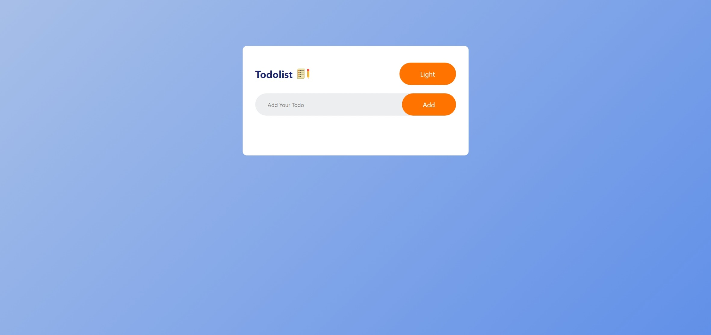
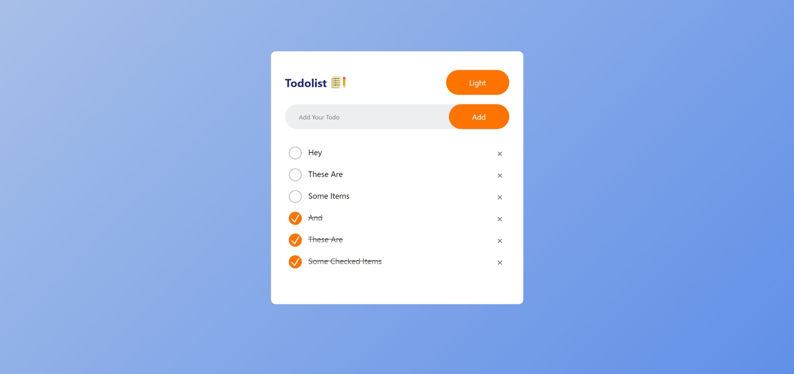
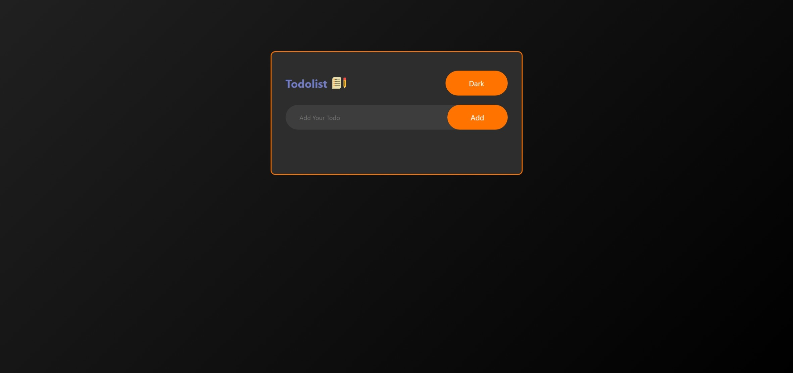
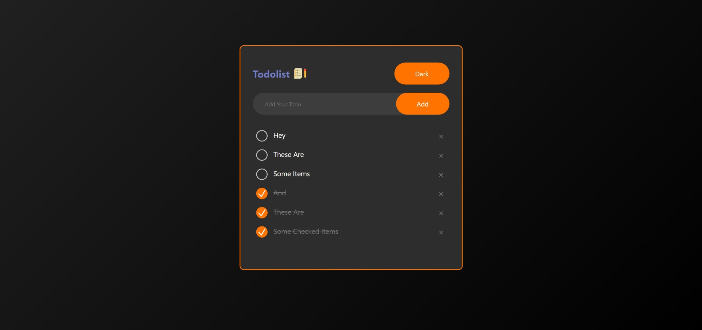

# Todolist

A simple todolist in which you can add tasks and remove them.

Thanks to [GreatStack](https://www.youtube.com/@GreatStackDev) for the [tutorial](https://www.youtube.com/watch?v=G0jO8kUrg-I), it helped a lot with the styling of the webpage (I am clueless with CSS).

---

## Todo:
  - ~~Save todos through refreshes~~
  - ~~Add background~~
  - ~~Make the main app a seperate container~~
  - ~~Make the buttons look better~~
  - ~~Put the list below the promt~~
  - ~~Make the promt stay still when adding items~~
  - ~~Change functonality for marking as done~~
  - ~~Make the state of todos save across refreshes~~
  - ~~Add Toggleable Dark Mode~~
  - ~~Add transition to dark mode~~

---

## Screenshots

| Name                       | Preview                                          |
| :---:                      | :---:                                            |
| Light Empty List           |  |
| Light List With Some Items |  |
| Dark Empty List            |   |
| Dark List With Some Items  |   |
