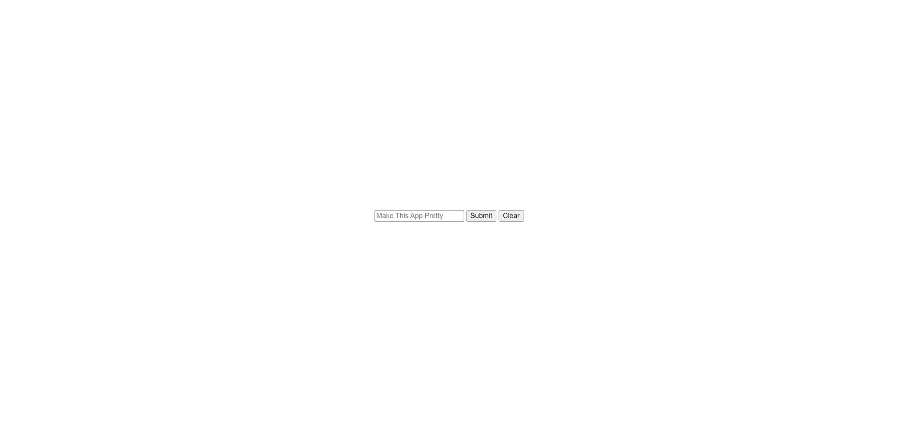

# Todolist

A simple todolist in which you can add tasks and remove them. Currently very ugly.

---

## Todo:
  - Add background and make the main app a seperate container
  - Make the buttons look better
  - Put the list below the promt
  - Make the promnt stay still when adding items
  - Change functonality for marking as done
  - Add Dark Mode

---

## Screenshots

|          Name             |                Preview                     |
|          :---:            |                 :---:                      |
| Empty List                |              | 
| The List with some items  |         | 
